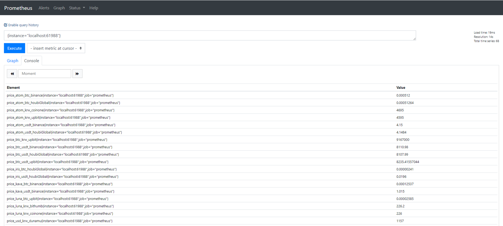

## price_exporter
Prometheus exporter for cryptocurrency prices.  
(default serivce port: 61988)


## List of APIs
- USD to KRW
  - from Dunamu
- BTC to KRW
  - from Upbit
- BTC to UDST
  - from Upbit
  - from Binance
  - from HoubiGlobal
- ATOM to KRW
  - from Coinone
  - from Upbit
- ATOM to USDT
  - from Binance
  - from HuobiGlobal
- ATOM to BTC
  - from Binance
  - from Upbit
  - from HuobiGlobal
- LUNA to KRW
  - from Coinone
  - from Bithumb
- LUNA to BTC
  - from Upbit
- IRIS to USDT
  - from HuobiGlobal
- IRIS to BTC
  - from HuobiGlobal
- KAVA to BTC
  - from Binance
- KAVA to USDT
  - from Binance
- KAVA to KRW
  - from Coinone
- SOL to BTC
  - from Binance
- SOL to BUSD
  - from Binance
  

## Install
```bash
mkdir price_exporter && cd price_exporter 

wget https://github.com/node-a-team/price_exporter/releases/download/v0.2.1/price_exporter.tar.gz  && sha256sum price_exporter.tar.gz | fgrep 5afa531ecccf78dce5f56f873f48b4532eb62fcfad3575c9a123b0efa79a651d && tar -zxvf price_exporter.tar.gz ||  echo "Bad Binary!"
```


## Start
  
```bash
./price_exporter {path to config.toml}

// ex)
./price_exporter /data/monitoring/price_exporter
```


## Use systemd service
  
```sh
# Make log directory & file
sudo mkdir /var/log/userLog  
sudo touch /var/log/userLog/price_exporter.log  
# user: monitoring
sudo chown monitoring:monitoring /var/log/userLog/price_exporter.log

# $HOME: /data/monitoring
# Path to config.toml: /data/monitoring/price_exporter
sudo tee /etc/systemd/system/price_exporter.service > /dev/null <<EOF
[Unit]
Description=Price Exporter
After=network-online.target

[Service]
User=monitoring
WorkingDirectory=/data/monitoring/price_exporter
ExecStart=/data/monitoring/price_exporter/price_exporter \
        /data/monitoring/price_exporter
StandardOutput=file:/var/log/userLog/price_exporter.log
StandardError=file:/var/log/userLog/price_exporter.log
Restart=always
RestartSec=3

[Install]
WantedBy=multi-user.target
EOF

sudo systemctl enable price_exporter.service
sudo systemctl restart price_exporter.service


## log
tail -f /var/log/userLog/price_exporter.log
```

## Examples
- Logs

- Prometheus_elements

